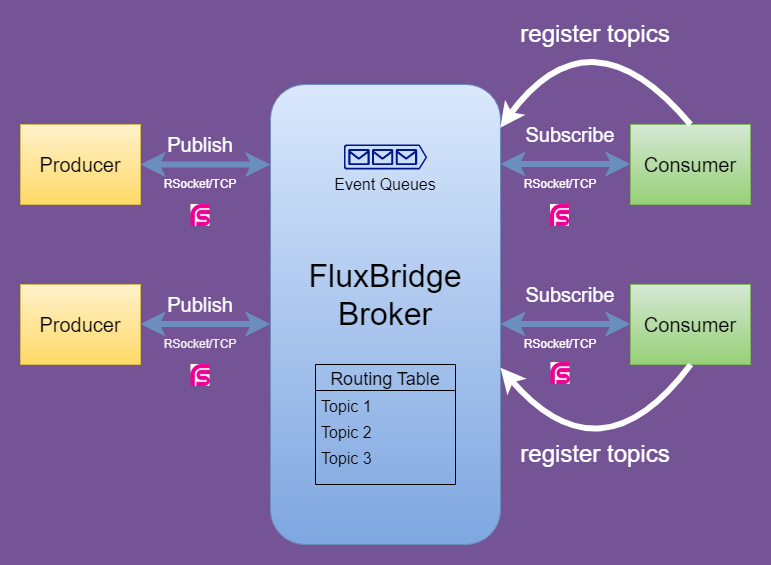

= FluxBridge
:css-signature: demo
:toc: macro
:toclevels: 2
:icons: font

toc::[]

== Overview

FluxBridge is a publish-subscribe message broker build on top of https://rsocket.io/[RSocket] protocol. It can be used in many distributed systems, such as microservices and event-driven architectures. Publishers send messages to a topic or channel, and subscribers receive messages from that topic or channel. The broker acts as an intermediary between the publishers and subscribers, ensuring that messages are delivered to the correct destination.

The publish-subscribe pattern is based on the concept of decoupling. Publishers and subscribers are decoupled from each other, and they do not need to know about each other's existence. This makes it easy to add new publishers or subscribers without affecting the existing system.

== User Guide

=== Components
* fluxbridge-broker: FluxBridge Broker itself.
* fluxbridge-common: Common library, including configurations, annotations and support classes.
* fluxbridge-consumer-demo: Spring boot app that demonstrates the usage of FluxBridge consumer (subscriber).
* fluxbridge-producer-demo: Spring boot app that demonstrates the usage of FluxBridge producer (publisher).

=== Prerequisite
* JDK 11
* Gradle 7.6.1

=== Run the app
[source]
----
./gradlew bootRun
----

=== Producer example

Import FluxBridgeConfiguration.class in main/configuration class
[source, Java] 
----
@SpringBootApplication
@Import(FluxBridgeConfiguration.class)
public class FluxbridgeConsumerDemoApplication {
	public static void main(String[] args) {
		SpringApplication.run(FluxbridgeConsumerDemoApplication.class, args);
	}
}
----

Annotate the consumer method with @FluxBridgeListener Annotation, specify the topic with method parameter DataSpec.
Once the producer publish a message with corresponding topic, metadata and data from that message can be obtained.
[source, Java] 
----
@Controller
@Slf4j
public class DemoConsumer {

    @FluxBridgeListener(topic = "register")
    public void register(DataSpec dataSpec) {
        log.info("receiving metadata: {}", dataSpec.getMetadata());
        log.info("receiving data: {}", dataSpec.getData());
        // your business logic here
    }

}
----

===  Consumer example 

As the broker is build on top of RSocket. You need to configure a rsocket requester in your application.
[source, Java]
----
@SpringBootApplication
public class FluxbridgeProducerDemoApplication {

	public static void main(String[] args) {
		SpringApplication.run(FluxbridgeProducerDemoApplication.class, args);
	}

    // broker host
	@Value("${fluxbridge.host}")
	String fluxBridgeHost;

    // broker port
	@Value("${fluxbridge.port}")
	int fluxBridgePort;
    
	@Bean
	RSocketRequester rSocketRequester() {
		return RSocketRequester.builder()
				.rsocketStrategies(
						RSocketStrategies.builder()
								.decoder(new Jackson2JsonDecoder())
								.encoder(new Jackson2JsonEncoder())
								.metadataExtractorRegistry(metadataExtractorRegistry -> {
									// meta
								})
								.dataBufferFactory(new DefaultDataBufferFactory(true))
								.build()
				)
				.tcp(fluxBridgeHost, fluxBridgePort);
	}
}
----

Here is an example to publish a message to the broker
[source, Java]
----
@RestController
@Slf4j
public class RestController {

    @Autowired
    private RSocketRequester rSocketRequester;

    @PostMapping("/register")
    public String register() {

        Gson gson = new Gson();

        var res = rSocketRequester
                .route("publish")
                .data(Message
                        .builder()
                        .topic("register")
                        .data(gson.toJson(new User("tommyho")))
                        .build()
                )
                .retrieveMono(String.class)
                .block();

        return "finished";
    }
}
----

== Performance and Benchmarking